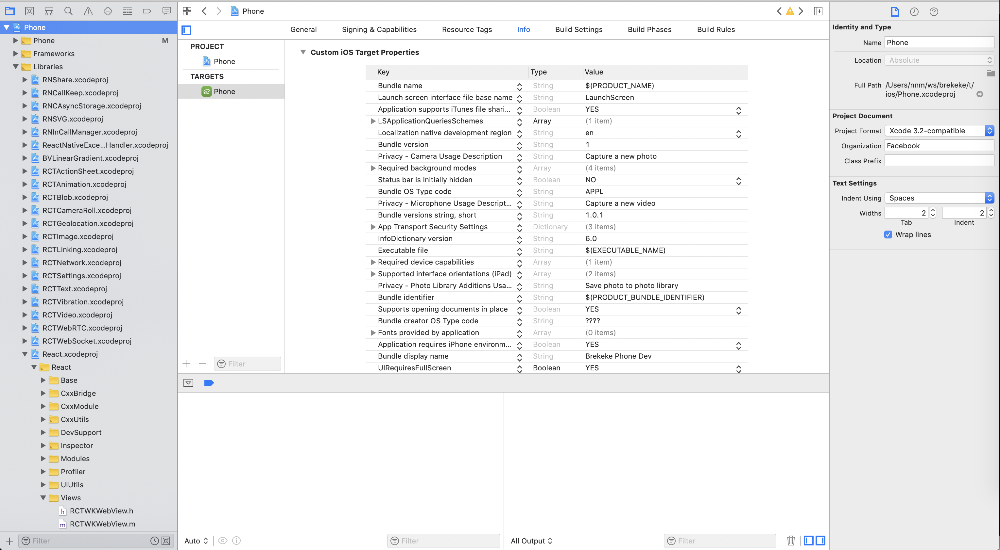

### Fix ios deprecated UIWebView in React Native

- Make sure to pull your code latest, and run `yarn install`

- In XCode open the tree as following Phone > Libraries > React.xcodeproj > React > Views:
  
- Select the web view files and remove them:
  

- Archive the project again. Note: everytime you archive the project, you should check if those files must be removed
